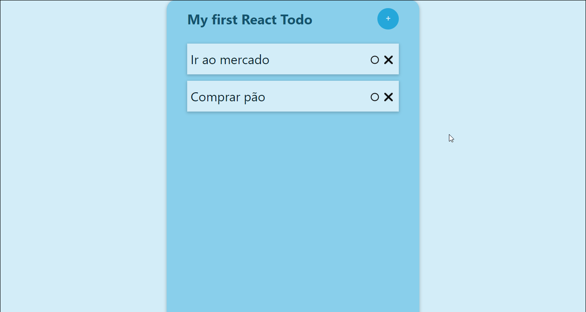
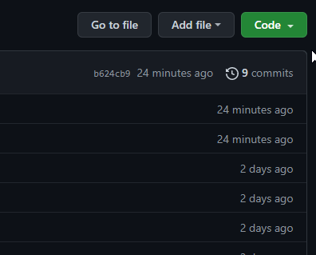
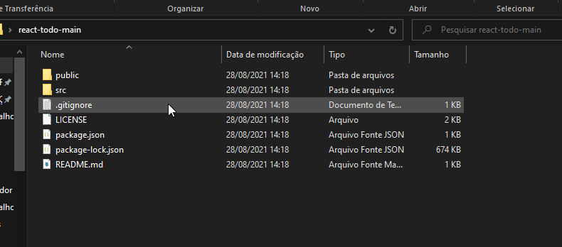

# 📑 Todo List com React

## [🙂 Testar o App 🙂](https://ericktodo.netlify.app)

### Tecnologias Utilizadas

##### - ReactJS 💛
##### - NodeJS 💚
##### - CSS 💙

### O que aprendi

Entendi como criar um projeto React com a ajuda do template "npx create-react-app", a componentização de elementos feita pelo React e os React Hooks que atualizam os elementos da página separadamente.

### Fui além

Apesar de ja ter conhecimentos de Bootstrap💜, preferi estilizar a página com CSS puro para exercitar o conhecimento. Resolvi o problema de ordenação sequêncial da lista, por meio do Local Storage.

### Como rodar a aplicação?

1° Baixe o projeto clicando no botão verde com uma seta para baixo em Download Zip

2° Caso não tenha o Node.JS em sua máquina, instale-o aqui [nodejs.org](https://nodejs.org)

3° Extraia o arquivo baixado no local de sua preferência e copie o endereço do local onde você o extraiu

5° Aperte a tecla do Windows, digite "prompt" e execute o prompt de comando em modo administrador

6° Digite "CD" dê um espaço, cole o endereço que havia copiado e aperte enter

7° Digite "npm i", aperte enter e espere o download dos pacotes terminar

8° Digite "npm start" e aperte enter

9° Esse processo demora um pouco para carregar pela primeira vez, mas em seguida o projeto deve abrir em seu navegador 🙂

## Meus Contatos

#### - Linkedin 👨‍💻 [https://linkedin.com/in/erickmacena](https://linkedin.com/in/erickmacena)

#### - Email 📧 erickmacena2@gmail.com
